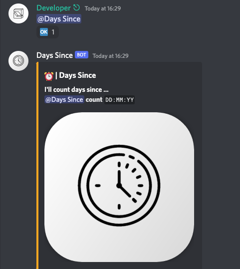
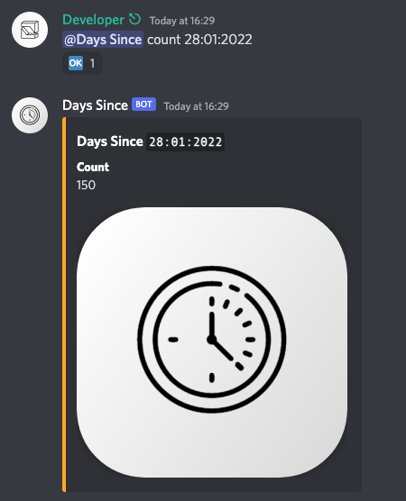

<h2 align="center">
    <i>Days Since</i> – the Discord Bot
    <br>
    
    <a href="https://discord.com/api/oauth2/authorize?client_id=990906101644005426&permissions=59456&scope=bot">
        
    </a>
</h2>

A _light-weight_, __open-source Discord__ bot written in `Discord.js` with `TypeScript` that is used to track the number of days _since_ a **desired date** provided by the user.

### Usage

The usage is fairly simple - the user simply needs to type the following command in any channel the bot has access to:

```sh
@Days Since count <DD:MM:YY>
```
\*where `<DD:MM:YY>` is the date to track desired by the user.



### Demo

Here we display the number of days that have passed since the date provided by the user, namely: `28:01:2022`.



### Running locally

Following the steps below, one is able to run the bot locally on the machine.

```sh
# 1. clone the repository
git clone https://github.com/michalspano/days-since.git

# 2. install dependencies (package.json provided)
npm install

# 3. create a .env file in the root directory
#   and fill it with the following variables:
#   - TOKEN=<your discord bot token>
echo "TOKEN=<your discord bot token>" > .env

# 4. run the bot
npm start
```

<!-- Links and references -->
[discord-shield]: https://img.shields.io/badge/Add%20to%20your%20server-7289DA?style=for-the-badge&logo=discord&logoColor=white
[discord-url]: https://discord.com/api/oauth2/authorize?client_id=990906101644005426&permissions=59456&scope=bot

